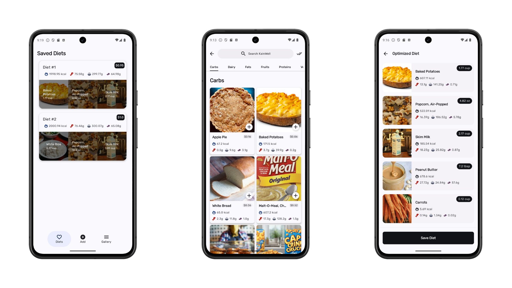

# KainWell

KainWell is an Android diet planning application built with [Jetpack Compose][compose],
and [Firebase Firestore][firestore].
It utilizes optimization algorithms to generate personalized meal plans based on user-defined
nutritional goals.

## Screenshots

## Data

Food items are sourced by the given material by the instructor.

Imagery is sourced from [Unsplash](https://unsplash.com/)
and [Google Image](https://images.google.com/), and loaded using the [Coil][coil] library.

[compose]: https://developer.android.com/jetpack/compose

[coil]: https://coil-kt.github.io/coil/

[firestore]: https://firebase.google.com/docs/firestore